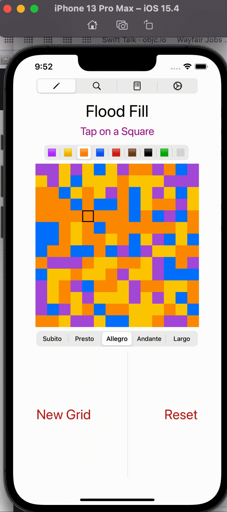

## FloodFill
A Graphic Introduction to Intermediate Swift Concepts

There's a lot of `Swift 101` style information available online. The thing is, Swift is a very powerful language and new features are constantly emerging and evolving. For a developing technician it can be daunting to move from novice to intermediate programmer. StackOverflow is a wonderful resource if you know what you need to ask for and formulate your question well. Reddit can provide you with some fleeting moral support. Twitter has lots of busy people drifting in and out. So how to navigate your way as a budding developer?

In the process of preparing for an upcoming interview, I stumbled across an old gem, an algorithm called `Flood Fill`.  (See links below)

It’s a simple concept, and the resulting code is fairly compact, but it takes a few minutes to wrap your head around.  You may not have a few minutes during an interview, so it’s best to get a heads up by digesting the concept and potential solutions. So I decided to take it one step further, and code an animation of the flood fill algorithm. The result is what you find here.

Typically the algorithm is described in a slightly abstract, mathematic way, but I’m a fan of color. So I’m going to present how it works graphically.

Starting with a randomized grid of colors, click on any cell.  In a flood fill, the square underneath the cursor will flip color, and any adjacent cells (vertical, horizontal, not diagonal) of the same color are flipped as well.

Those old-timers reading this can spot the similarity with Conway’s “Life” animation (links below) where a cell value is updated depending on the state of a neighboring cell.

You can solve this problem iteratively or using recursion, and of course the interviewer may tell you which is expected of you. So be prepared to solve it both ways.

I’ll have a bit more to say about the algorithm in the next link, but I want lay out a plan for what I expect to cover here.

# [Note: I am in the process of uploading these files - you will encounter a lot of dead links right now]
## Please come back soon!

### Here's a list of the chapters with a brief summary

#### About This Project
   This page. A description of our journey ahead.
   
### [Dreaming of a Loaf](./01-Dreaming of a Loaf.md)
   A parable to serve as an introduction to recursion.
   
### [The Algorithm](./02-The Algorithm.md)
   Is this the meat and potatoes of the project?
   
### [Protocols and Protocol Conformance](03-Protocols and Protocol Conformance.md)
   When you tell the compiler more about your data structures it can make your life easier.

### [Bindings and Property Wrappers](04-Binding and Property Wrappers.md)
- Bindings are what make SwiftUI so magical, and property wrappers make it easier for you to use them. 
- An overview of how bindings provide two way communication, followed by some of the mechanics of hooking into Combine.
- I conclude by discussing how wrappers reduce the boilerplate you would otherwise have to provide.

### [Pointfree and Bindings](05-A PropertyWrapper from PointFree - BindableState.md)
   We're going to take your new found knowledge of bindings to a whole new level!
   
### [The Composable Architecture](06-The Composable Architecture.md)
   It's a giant step from bindings to the world of TCA.
   Functional Programming principles guide a structured approach to updating your data and having your `Views` update themselves automatically.
   
### [Integrating TCA Into This Project](07-Integrating TCA.md)

Pickers and a couple of taps.  
I review a simple (but complete) `State/Action/Environment/reducer` setup using `.binding()` and the more traditional `.send()`   

The discussion has been kept simple, and I’ve tried to help connect the `how` or `why	` when explaining the relationships between the individual lines of code and the architecture of the system.

## Appendix

### [Vocabulary](a  Wortschatz.md)

### [Random Links - Unfinished Business](b  Random Links.md)

>For anyone who finds this sample/tutorial trivial, I have a challenge for you!  I have yet to complete a version that animates correctly using the recursive algorithm.  I describe the problem I encountered below. Please open an issue and paste a code snippet if you are able to get a sequential animation of the cells using a recursive algorithm (it doesn’t have to be the one I used…) I will edit this page explaining the addition so everyone can benefit from your contribution.
I opened two questions on StackOverflow related to the issues encountered, and I can open more.

#### Why Do I See `public` so often in the example code?
 
I write almost all of my code in modules (Swift Packages using the Swift Package Manager). Without the `public` **access modifier** the code would not be visible outside the package, which means it can’t be called from outside the package. This is because the default access level in Swift is `internal`.  
Each module specifies a namespace and enforces access controls on which parts of that code can be used outside of the module.

I’ll have more to say about namespaces in another project. Here’s a couple of links in case you’re curious:

[Leonardo Maia Pugliese](https://holyswift.app/introduction-to-app-modularisation-with-swift-package-manager-a-tale-to-be-told)

[Package vs. Module](https://stackoverflow.com/questions/39499281/what-is-the-difference-between-a-swift-package-and-a-module)

You can probably skip the access modifier if all your code is in the one Xcode project you’re working on, but be aware that if you declare a protocol `public`, then you will see a cascading effect as the compiler enforces consistency. You have probably seen this if you have declared a View as `public`. The `View` protocol requires that a `public` **View** has a `public` **init** and a `public` **body**.

You probably already knew this, although may not have known why.

## Acknowledgements

I am grateful to the many people online who contribute to the Swift Community in so many ways.
Here is a partial list of the people and organizations that have made my journey more exciting and perhaps a bit less bumpy.

[Swift Forums](https://forums.swift.org)  
[Apple Developer Forums](https://developer.apple.com/forums/)  
[GitHub](https://github.com)  
[StackOverflow](https://stackoverflow.com)  

### Sites (Alphabetic)
[Erica Sadun]()  
[John Sundell]()  
[HackingWithSwift (Paul Hudson)]()  
[Majid]()  
[Natasha the Robot]()  
[Pointfree.com]()  
[SwiftTalk (objcio)]()  

### Individuals:
[Asperi (StackOverflow)](https://stackoverflow.com/users/12299030/asperi)  
[martin-r (StackOverflow)](https://stackoverflow.com/users/1187415/martin-r)  
[rmaddy (StackOverflow)](https://stackoverflow.com/users/1226963/rmaddy)  
[Rob (StackOverflow)](https://stackoverflow.com/users/1271826/rob)    
[Rob Mayoff (StackOverflow)](https://stackoverflow.com/users/77567/rob-mayoff)  
[vacawama (StackOverflow)](https://stackoverflow.com/users/1630618/vacawama)  

I urge you to visit these sites, patronize and contribute where you can, become a contributor to the community as well!

## Links

[Next](./01-Dreaming of a Loaf.md)

### Conway’s `Life` algorithm/game

[LearnAppMaking.com](https://learnappmaking.com/game-of-life-in-swift-how-to/)  
[Nathan Gitter - Pentatonic](https://github.com/nathangitter/PentatonicGameOfLife)  

### Flood Fill References

[Wiki](https://en.wikipedia.org/wiki/Flood_fill)  
[Geeks](https://www.geeksforgeeks.org/flood-fill-algorithm-implement-fill-paint/)  
[Leet](https://leetcode.com/problems/flood-fill/)  

.pct 80
